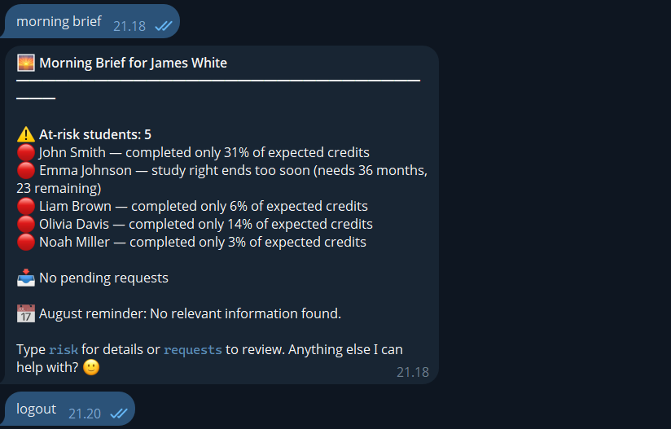
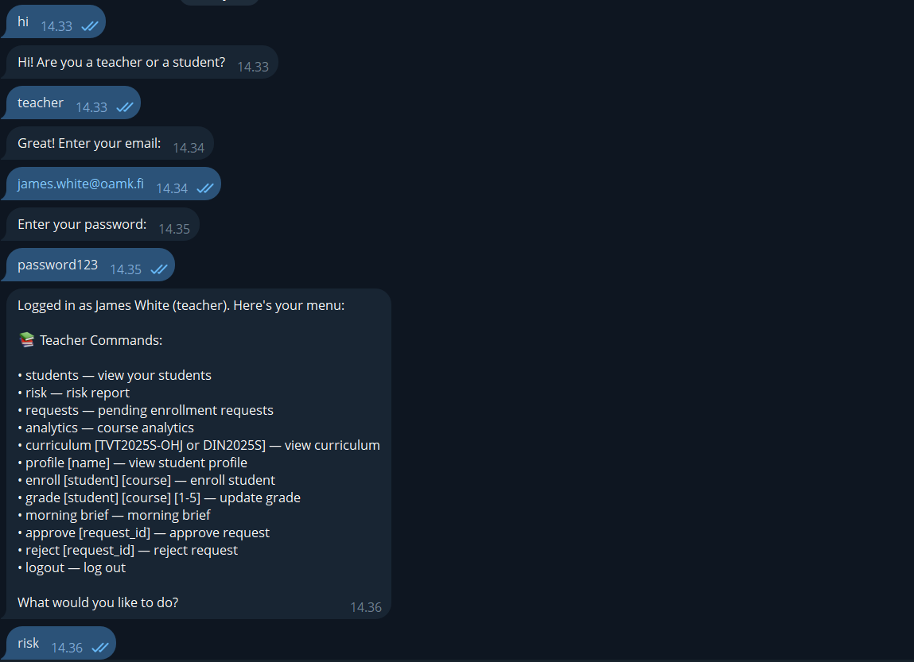
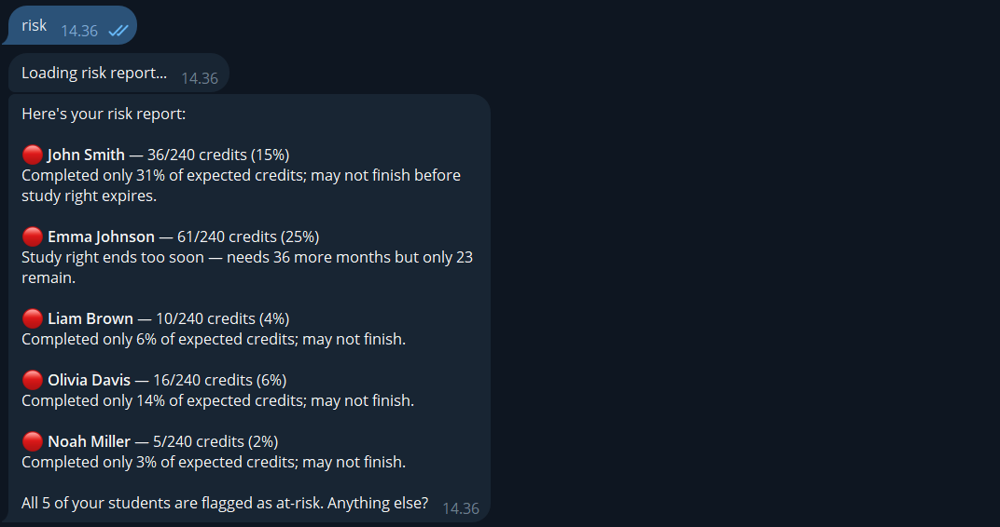
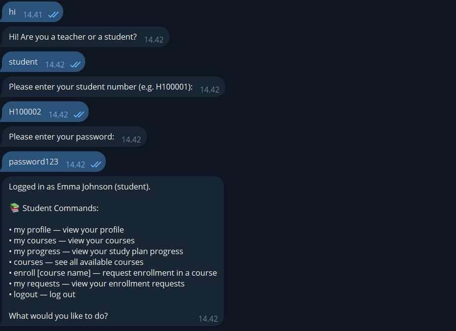
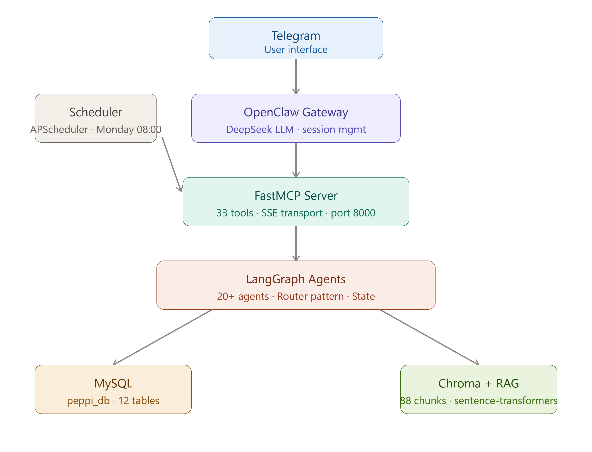
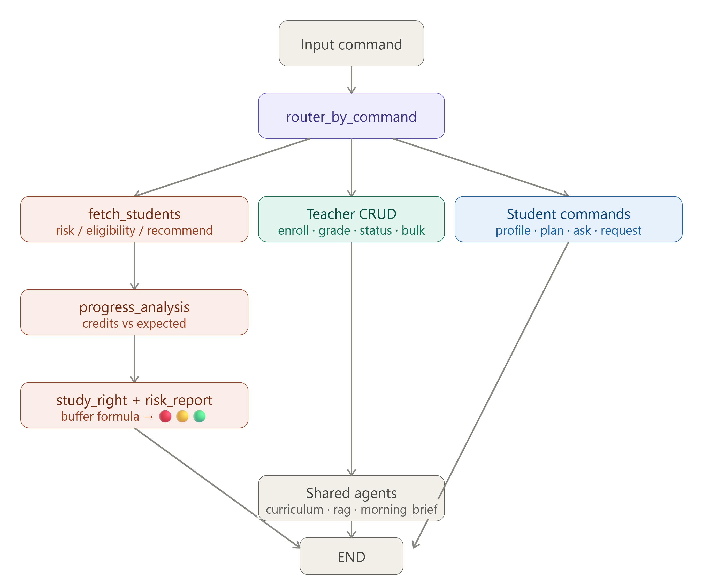
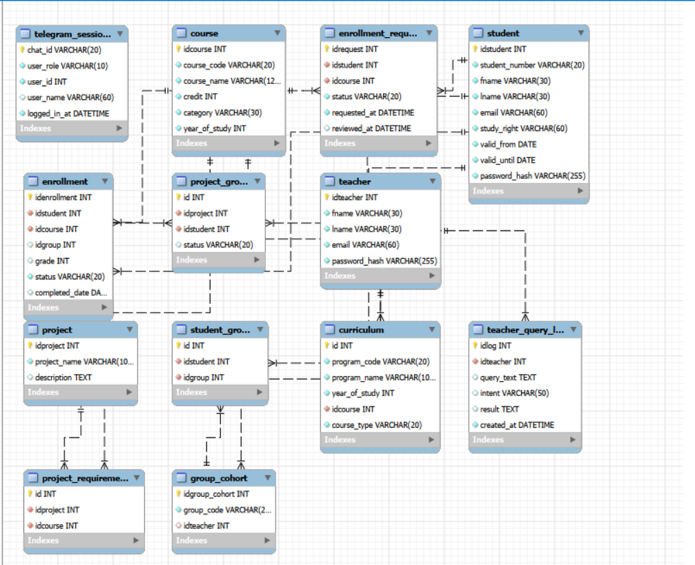

# Interactive AI Tutor Assistant

An AI-powered tutoring assistant for university tutors and students at OAMK (Oulu University of Applied Sciences). Built with LangGraph, MCP, and DeepSeek LLM. Supports two real degree programs: **TVT2025S-OHJ** (Finnish) and **DIN2025S** (English).

## Features

### Teacher
- Monitor student progress, credits, study rights, and risk status
- Enroll students in courses with **prerequisites check** for projects
- Update grades and enrollment status
- Approve or reject student enrollment requests (with ownership verification)
- View curriculum by year (TVT and DIN programs)
- View analytics — course stats, group performance
- **Adaptive risk scoring** combining credit gap and study right buffer
- **Morning Brief on login** — at-risk students + pending requests + calendar hint
- **Fuzzy student search** — find by partial name or student number
- **"Back" to cancel** at any step without losing context
- Query history logging
- Export reports (risk, analytics, courses)

### Student
- View own academic profile and full study plan with progress indicators (✅🔄📋❌)
- Check project eligibility based on completed prerequisites
- Get AI-powered study recommendations (RAG-based)
- Request enrollment in courses
- Track status of enrollment requests
- Ask questions about curriculum, courses, and study guidelines

### Autonomous Scheduler
- **Weekly Brief every Monday at 08:00** — sends Telegram notification automatically
- Runs as a separate process independently of the CLI
- Combines at-risk analysis, pending requests, and calendar reminders

## Tech Stack

| Component | Technology |
|---|---|
| Agent framework | LangGraph 20+ agents, Router pattern |
| LLM | DeepSeek (`deepseek-v4-flash`) via OpenClaw |
| MCP server | FastMCP, 15+ tools, SSE transport |
| Database | MySQL 8.0 (`peppi_db`), connection pooling |
| Authentication | bcrypt, teacher/student roles, 3-attempt lockout |
| RAG | Chroma + sentence-transformers (CPU-only), 88 chunks, smart chunking |
| Telegram | OpenClaw gateway |
| Scheduler | APScheduler (AsyncIOScheduler), cron trigger |
| Infrastructure | Docker, docker-compose, GitHub Actions CI/CD |

## Programs in the System

**TVT2025S-OHJ** — Tietotekniikan tutkinto-ohjelma, Ohjelmistokehitys
- 4 years, 240 credits, taught in Finnish
- 36 real courses with official codes (IN00CS84, IN00DL11, etc.)

**DIN2025S** — Degree Programme in Information Technology
- 4 years, 240 credits, taught in English
- 34 courses with official OAMK codes (ID00CS34, ID00EK08, etc.)

## Database

- **15 students** (10 TVT + 5 DIN) with realistic progress scenarios
- **10 teachers** across 4 group cohorts (TVT24SPO, TVT25SPO, AVOVAY25S, DIN25SPO)
- **72 courses** from official OAMK curriculum
- **3 projects** with prerequisite checks (AI Chatbot, Web App, Mobile App)
- **42 enrollments** with realistic grade distribution


## Commands

### Teacher
```
profile       — Student profile (fuzzy search by name or number)
course        — Students in a specific course
enroll        — Enroll student in a course (with prerequisites check)
grade         — Update student grade (1-5)
status        — Update enrollment status
group         — All students in a group
bulk          — Enroll entire group in a course
courses       — All available courses
curriculum    — Program curriculum by year (TVT2025S-OHJ / DIN2025S)
analytics     — Course or group analytics
risk          — Adaptive risk report (credit gap + study right buffer)
history       — Teacher query history
ask           — RAG-powered question answering
export        — Export reports to file
requests      — Pending/approve/reject enrollment requests
me            — Teacher profile and groups
morning_brief — On-demand morning brief summary
password      — Change password
help          — Show all commands
exit          — Logout
```

### Student
```
profile      — Own academic profile
eligibility  — Project eligibility check
recommend    — AI course recommendations
courses      — All available courses
plan         — Full study plan with progress (✅🔄📋❌)
ask          — RAG-powered question answering
request      — Request enrollment in a course
my_requests  — Track enrollment request status
password     — Change password
help         — Show all commands
exit         — Logout
```

## Risk Scoring Algorithm

The system uses adaptive risk scoring combining two factors as specified in the project assignment:

```
credits_remaining = 240 - credits_earned
months_needed = credits_remaining / 5  (60 credits/year = 5/month)
months_left = (valid_until - today).days / 30
buffer = months_left - months_needed
completion_rate = credits_earned / credits_expected_now
```

Example from assignment specification:
- Student A: 100/240 credits, 12 months left → buffer = -11 months → 🔴 Critical
- Student B: 235/240 credits, 12 months left → buffer = +11 months → 🟢 On track

## RAG Knowledge Base

The system uses RAG (Retrieval-Augmented Generation) with real OAMK course descriptions:

- `course_descriptions.txt` — DIN2025S course descriptions (English)
- `course_descriptions_tvt.txt` — TVT2025S-OHJ course descriptions (Finnish)
- `curriculum_guide.txt` — Program structure and prerequisites
- `student_faq.txt` — Student FAQ with real course codes
- `study_right_guide.txt` — Study right and credit pace guidelines
- `tutoring_calendar.txt` — Month-by-month tutoring calendar with system commands

Smart chunking: documents with `---` separators are chunked per course/section, others use character-based chunking with 50-character overlap.

## Run with Docker

```bash
# Clone and configure
git clone https://github.com/mopsipriv/interactive-ai-tutor.git
cd interactive-ai-tutor
cp agents/.env.example agents/.env  # fill in DB credentials and API keys
cp agents/.env .env

# Start all services
docker compose up -d

# Run interactive CLI
docker compose run --rm app

# Run autonomous scheduler (separate terminal)
docker compose run --rm app python run_scheduler.py
```

### Services
| Container | Description | Port |
|---|---|---|
| `peppi-mysql` | MySQL database | 3306 |
| `peppi-mcp` | FastMCP server (SSE) | 8000 |
| `peppi-app` | LangGraph CLI app | — |

## Run Locally

```bash
# Terminal 1 — MCP server
fastmcp run mcp_server.py --transport sse --host 0.0.0.0 --port 8000

# Terminal 2 — App
python -m agents.draft_graph

# Terminal 3 — Autonomous scheduler (optional)
python run_scheduler.py
```
## Quick Start

### Prerequisites
- Docker and Docker Compose
- Python 3.11+ (for local run)
- OpenClaw (for Telegram integration)

### 1. Clone and configure
```bash
git clone https://github.com/mopsipriv/interactive-ai-tutor.git
cd interactive-ai-tutor
cp agents/.env.example agents/.env  # fill in your credentials
cp agents/.env .env
```

### 2. Start services
```bash
docker compose up -d
```

### 3. Run CLI
```bash
docker compose run --rm app
```

### 4. Run Telegram bot (requires OpenClaw)
```bash
# Start OpenClaw
cd ~/openclaw && docker compose up -d

# Connect MCP server
./update_mcp_ip.sh
docker network connect interactive-ai-tutor_default openclaw-openclaw-gateway-1

# Bot is now active in Telegram
```

### 5. Run autonomous scheduler (optional)
```bash
docker compose run --rm app python run_scheduler.py
```

### Default credentials (demo)
| Role | Email / Number | Password |
|---|---|---|
| Teacher | james.white@oamk.fi | password123 |
| Student | H100001 | password123 |


## Screenshots

### CLI — Morning Brief on teacher login


### Telegram — Teacher login and menu


### Telegram — Risk report


### Telegram — Student login and menu


## System Architecture



## Agent Flow



## Database Schema (ERD)




## Architecture

```
Telegram
   ↓
OpenClaw Gateway (DeepSeek LLM)
   ↓
MCP Server (FastMCP, 15+ tools, SSE)
   ↓
LangGraph (20+ agents, Router pattern)
   ↓
MySQL (peppi_db) + Chroma (RAG)

Autonomous Scheduler (APScheduler)
   ↓
Weekly Brief → Telegram notification
```

## Agent Architecture

The system follows the assignment specification with 5 core specialized agents plus additional agents for extended functionality.

### Core Agents (as specified in project assignment)

**Calendar Agent** (`calendar_agent`)
Understands the tutoring calendar via RAG. Retrieves relevant actions and reminders for the current month from the knowledge base.

**Progress Analysis Agent** (`progress_analysis_agent`)
Analyzes student credit accumulation and progression pace. Calculates expected vs actual credits based on enrollment date.

**Study Right Agent** (`study_right_agent`)
Monitors study right expiry dates and combines them with remaining credits using the buffer formula to assess real urgency.

**Recommendation Agent** (`recommendation_agent`)
Generates personalized study recommendations based on student progress, completed courses, and curriculum requirements.

**Communication Agent** (`communication_agent`)
Creates summaries and messages for tutors. Generates the Morning Brief combining at-risk data, pending requests, and calendar hints.

### Additional Agents (beyond specification)

| Agent | Purpose |
|---|---|
| `fetch_students_agent` | Loads students for teacher's groups with credit calculations |
| `eligibility_agent` | Checks project prerequisites against completed courses |
| `enroll_agent` | Enrolls student in a course via MCP tool |
| `grade_agent` | Updates student grade via MCP tool |
| `profile_agent` | Retrieves full student academic profile |
| `curriculum_agent` | Shows program curriculum by year (TVT/DIN) via RAG |
| `analytics_report_agent` | Course and group performance analytics |
| `rag_agent` | RAG-powered Q&A using course descriptions and guidelines |
| `request_course_agent` | Student enrollment request submission |
| `handle_request_agent` | Teacher approval/rejection with ownership verification |
| `morning_brief_agent` | Autonomous morning summary for teachers on login |
| `student_plan_agent` | Full study plan with progress indicators |

### Agent Flow

```
Input → router_by_command
   │
   ├── risk/eligibility/recommend
   │      └── fetch_students → progress_analysis → study_right
   │                        → eligibility → calendar → risk_report
   │                        → status → analytics → recommendation
   │                                             → communication
   │
   ├── Teacher CRUD commands
   │      └── enroll / grade / status_update / bulk_enroll / ...
   │
   ├── Student commands
   │      └── profile → student_recommendation
   │          plan / eligibility / ask / request / my_requests
   │
   └── Shared
          └── curriculum / courses / rag / morning_brief
```

### Why LangGraph over a simple chatbot

A traditional chatbot processes one question and returns one answer. LangGraph models the workflow as a directed graph where each node is a specialized agent with a specific responsibility. This allows:

- **Parallel concerns** — study rights and credit progress analyzed by separate agents
- **Conditional routing** — different commands trigger different agent chains
- **State persistence** — shared `State` TypedDict passes data between agents without re-querying the database
- **Extensibility** — new agents added as graph nodes without modifying existing logic

## Security

- Passwords hashed with bcrypt (`$2b$12$...`)
- Teachers see only students in their own groups (via `group_cohort.idteacher`)
- Enrollment request ownership verified before approve/reject
- Password input via `getpass` (hidden from terminal)
- MySQL connection pooling (`aiomysql.create_pool`, maxsize=10)
- Input validation on grades (1-5), statuses, request IDs
- "Back" cancellation at any input step via `BackException`
- OpenClaw: Telegram allowlist (single user ID), dangerous commands denied

## CI/CD

GitHub Actions pipeline runs on push to `main` and `rag-implementation` branches:
- Lint and syntax checks
- Docker build verification

## Project Status

✅ LangGraph 20+ agents with Router pattern
✅ FastMCP server with 15+ tools (SSE transport)
✅ MySQL database with real TVT + DIN curriculum (72 courses)
✅ bcrypt authentication, teacher/student roles, 3-attempt lockout
✅ RAG system with official OAMK course descriptions (88 chunks)
✅ Smart chunking (separator-based + character-based fallback)
✅ Enrollment requests workflow with ownership verification
✅ Analytics, risk reports, curriculum, export
✅ Adaptive risk scoring (credit gap + study right buffer)
✅ Morning Brief on teacher login
✅ Autonomous weekly scheduler (APScheduler, Telegram notifications)
✅ Fuzzy student search (partial name or student number)
✅ Prerequisites check for project enrollment
✅ "Back" cancellation at any input step
✅ Docker + docker-compose deployment
✅ GitHub Actions CI/CD
✅ OpenClaw + Telegram bot connected (MCP tools verified)
✅ Connection pooling, ownership checks, getpass security
✅ Full Telegram end-to-end command routing
✅ Telegram bot with session management (login/logout)
✅ Security tested (prompt injection resistant)